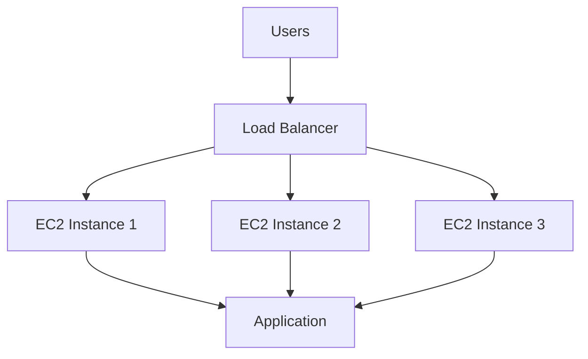
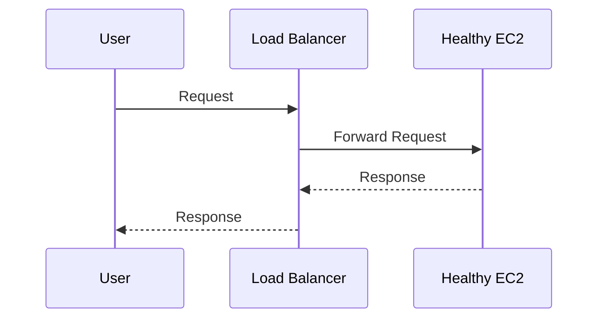
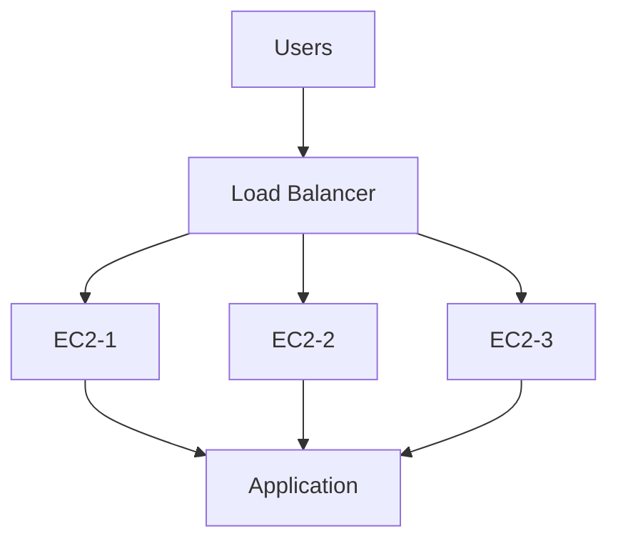
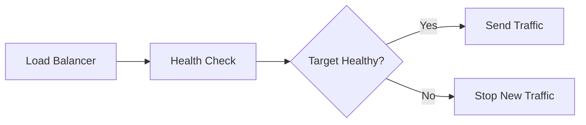
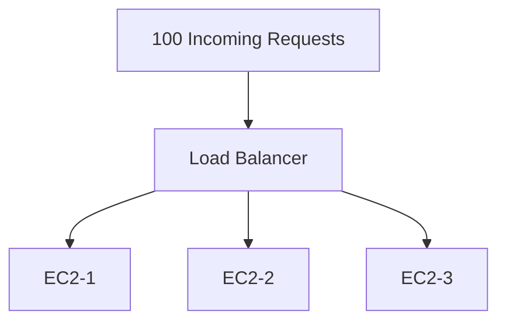
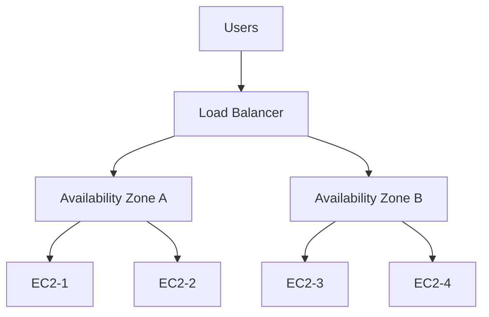
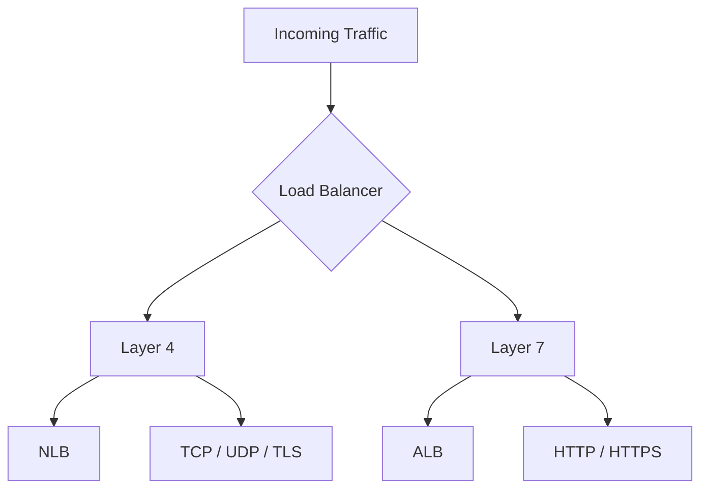
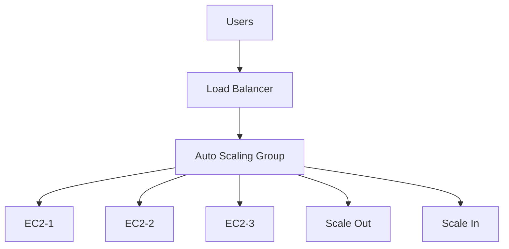
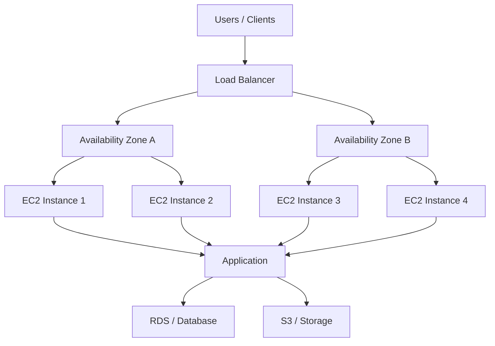
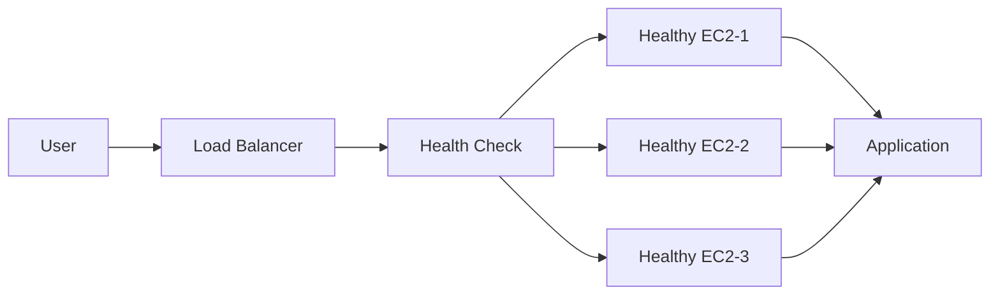

# AWS Load Balancer Basics

## Introduction

A Load Balancer distributes incoming application traffic across multiple servers or targets.

It helps improve:

* High Availability
* Scalability
* Fault Tolerance
* Application Performance

AWS provides Load Balancing through **Elastic Load Balancing (ELB)**.

---

## Basic Architecture



---

## How Load Balancer Works

1. User sends a request to the Load Balancer.
2. Load Balancer receives the request.
3. It checks the health of registered targets.
4. Traffic is forwarded to a healthy target.
5. The target processes the request.
6. Response is returned to the user through the Load Balancer.



---

## Why Do We Need a Load Balancer?

Without a Load Balancer:

```text
User
  |
  v
Single EC2
  |
  v
Application
```

If the EC2 instance fails, the application becomes unavailable.

With a Load Balancer:



If one instance fails, the Load Balancer can stop sending new traffic to that unhealthy instance.

---

## Key Components

### 1. Listener

A Listener checks for incoming connection requests on a configured protocol and port.

Example:

```text
HTTP : 80
HTTPS : 443
TCP : 80
```

---

### 2. Targets

Targets are the backend resources that receive traffic.

Examples:

```text
EC2 Instances
IP Addresses
Containers
```

---

### 3. Health Check

Health Checks determine whether a target is healthy and able to receive traffic.



---

### 4. DNS Name

The Load Balancer provides a DNS name that clients use to access the application.

```text
User
  |
  v
Load Balancer DNS
  |
  v
Healthy Targets
```

---

## Traffic Distribution

Example with three EC2 instances:



The Load Balancer distributes traffic across available healthy targets according to its routing behavior.

It should not be assumed that traffic will always be divided into an exact equal percentage between instances.

---

## High Availability

Load Balancers can work across multiple Availability Zones.



Using multiple Availability Zones helps reduce the impact of an Availability Zone or instance failure.

---

## Load Balancer Types in AWS

AWS Elastic Load Balancing provides four main types:

```text
1. Classic Load Balancer (CLB)
2. Application Load Balancer (ALB)
3. Network Load Balancer (NLB)
4. Gateway Load Balancer (GWLB)
```

### Classic Load Balancer

* Older generation Load Balancer
* Supports HTTP, HTTPS, TCP and SSL
* Commonly associated with EC2-based legacy applications

### Application Load Balancer

* Layer 7 Load Balancer
* Designed for HTTP/HTTPS applications
* Supports host-based and path-based routing

### Network Load Balancer

* Layer 4 Load Balancer
* Supports TCP, UDP and TLS
* Designed for high-performance and low-latency applications

### Gateway Load Balancer

* Used to deploy and scale virtual network appliances
* Commonly used with firewalls and security appliances

---

## Layer 4 vs Layer 7



---

## Load Balancer + Auto Scaling

Load Balancer and Auto Scaling Group are commonly used together.



### Flow

```text
High Traffic
     |
     v
Auto Scaling Group
     |
     v
Launch More EC2 Instances
     |
     v
Load Balancer
     |
     v
Distribute Traffic
```

---

## Real-World Architecture



---

## Benefits

| Benefit            | Description                                                |
| ------------------ | ---------------------------------------------------------- |
| High Availability  | Traffic can be served by multiple healthy targets          |
| Scalability        | Supports applications running on multiple instances        |
| Fault Tolerance    | Unhealthy instances can be removed from traffic            |
| Health Monitoring  | Continuously checks target health                          |
| Single Entry Point | Users access the application through one endpoint          |
| Security           | Can work with security groups and HTTPS/TLS configurations |

---

## Common Use Cases

Load Balancers are commonly used for:

```text
Web Applications
E-Commerce Applications
APIs
Microservices
High-Traffic Applications
Containerized Applications
Highly Available Applications
```

---

## Important Interview Questions

### What is a Load Balancer?

A Load Balancer distributes incoming traffic across multiple healthy servers or targets.

### Why do we use a Load Balancer?

To improve availability, scalability, fault tolerance, and application performance.

### What is a Listener?

A Listener accepts incoming connection requests on a configured protocol and port.

### What is a Health Check?

A Health Check verifies whether a registered target is healthy enough to receive traffic.

### What happens when a target becomes unhealthy?

The Load Balancer stops sending new traffic to that unhealthy target.

### What are the AWS Load Balancer types?

Classic Load Balancer, Application Load Balancer, Network Load Balancer, and Gateway Load Balancer.

### What is the difference between ALB and NLB?

ALB operates at Layer 7 and is designed mainly for HTTP/HTTPS traffic, while NLB operates at Layer 4 and supports TCP, UDP, and TLS.

### Can Load Balancer and Auto Scaling work together?

Yes. The Load Balancer distributes traffic while the Auto Scaling Group automatically adjusts the number of EC2 instances based on demand.

---

## Quick Revision



```text
Load Balancer
     |
     +-- Receives Traffic
     |
     +-- Checks Target Health
     |
     +-- Routes Traffic
     |
     +-- Improves Availability
     |
     +-- Works with Auto Scaling
```

---

## Key Takeaway

> A Load Balancer provides a single entry point for users and distributes incoming traffic across healthy backend targets. When combined with Auto Scaling, it helps build highly available, scalable, and fault-tolerant AWS applications.


