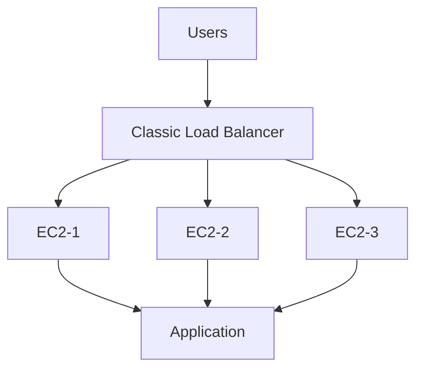
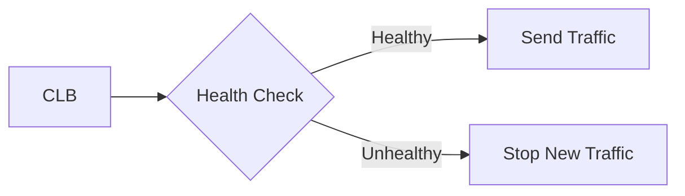
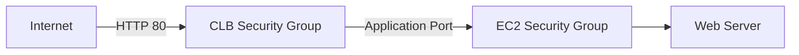
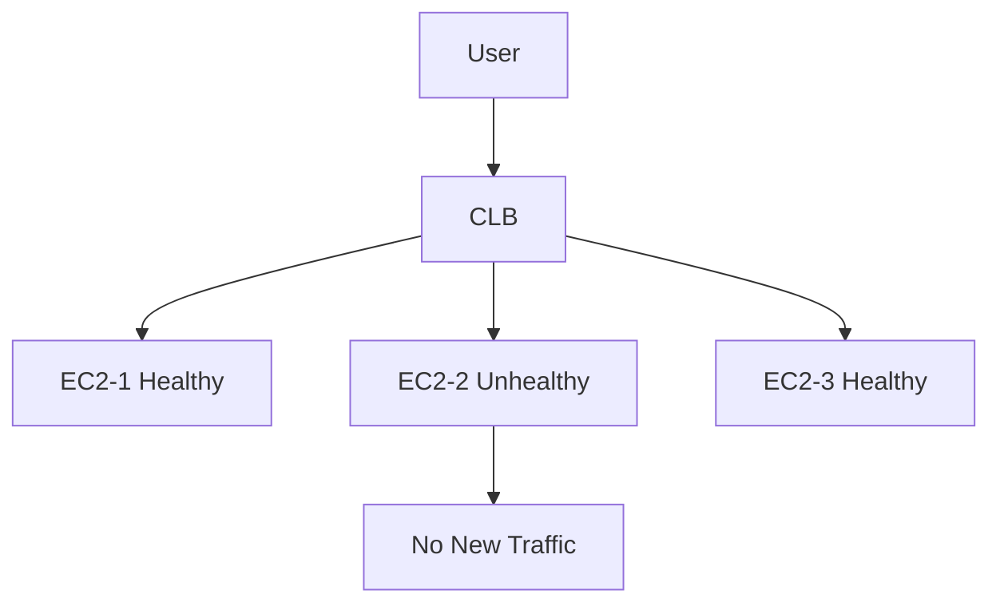

# AWS Classic Load Balancer (CLB)

## Introduction

Classic Load Balancer (CLB) is the **older generation** of AWS Elastic Load Balancing.

It distributes incoming traffic across registered EC2 instances and performs health checks to send traffic only to healthy instances.

> CLB is mainly useful for understanding legacy AWS architectures. For new applications, ALB or NLB is generally preferred.

---

## CLB Architecture



---

## Main Components

```text
Classic Load Balancer
│
├── Listener
├── Security Group
├── Health Check
├── Registered Instances
├── Sticky Sessions
├── Connection Draining
└── Cross-Zone Load Balancing
```

### Listener

Accepts incoming traffic on a configured protocol and port.

```text
HTTP : 80
HTTPS : 443
TCP : 80
SSL
```

### Health Check

Checks whether registered EC2 instances are healthy.



### Sticky Sessions

Keeps a user's requests associated with the same backend instance for the configured session duration.

```text
User → CLB → EC2-1
             ↑
        Same Session
```

### Connection Draining

Allows existing connections to complete before an instance is removed from service.

```text
Instance
   ↓
Connection Draining
   ↓
Existing Requests Complete
   ↓
Instance Removed
```

### Cross-Zone Load Balancing

Allows traffic to be distributed across registered instances in enabled Availability Zones.

---

# Steps to Create CLB

```text
AWS Console
→ EC2
→ Load Balancers
→ Create Load Balancer
→ Classic Load Balancer
```

### Configure

```text
1. Load Balancer Name
2. Internet-facing / Internal
3. VPC
4. Availability Zones / Subnets
5. Listener
6. Security Group
7. Health Check
8. Register EC2 Instances
9. Create Load Balancer
```

---

## Example Configuration

```text
Load Balancer Protocol : HTTP
Load Balancer Port     : 80

Instance Protocol      : HTTP
Instance Port          : 80

Health Check:
Protocol : HTTP
Port     : 80
Path     : /
```

---

## Security Group Flow



For production, restrict sources according to the application requirement rather than allowing unrestricted access unnecessarily.

---

## Test CLB

After creation, copy the CLB DNS name:

```text
CLB DNS Name
     ↓
Open in Browser
     ↓
Application Page
```

If one EC2 instance becomes unhealthy:



---

## CLB CLI Commands

### Create

```bash
aws elb create-load-balancer \
--load-balancer-name my-classic-lb \
--listeners Protocol=HTTP,LoadBalancerPort=80,InstanceProtocol=HTTP,InstancePort=80 \
--subnets subnet-xxxxxxxx subnet-yyyyyyyy \
--security-groups sg-xxxxxxxx
```

### Register Instances

```bash
aws elb register-instances-with-load-balancer \
--load-balancer-name my-classic-lb \
--instances i-xxxxxxxx i-yyyyyyyy
```

### Check Load Balancer

```bash
aws elb describe-load-balancers \
--load-balancer-name my-classic-lb
```

---

## Important Interview Questions

### What is CLB?

CLB is the older-generation AWS Load Balancer that distributes traffic across registered EC2 instances.

### Which protocols does CLB support?

HTTP, HTTPS, TCP and SSL.

### What is a Listener?

It accepts incoming connection requests on a configured protocol and port.

### What is a Health Check?

It determines whether a registered instance is healthy enough to receive traffic.

### What happens when an instance becomes unhealthy?

CLB stops sending new traffic to that instance.

### What is Sticky Session?

It keeps a user's session associated with the same backend instance.

### What is Connection Draining?

It allows existing connections to complete before removing an instance from service.

### Is CLB recommended for new applications?

CLB is a legacy-generation service. ALB or NLB is generally preferred for new architectures depending on the workload.

---


## Key Takeaway

> **Classic Load Balancer receives traffic through listeners, checks EC2 health, and distributes requests across healthy registered instances. It is a legacy Load Balancer but is important for understanding existing AWS environments and Load Balancing fundamentals.**
