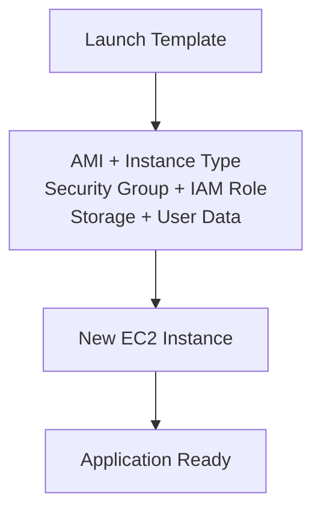

# AWS Launch Template

## Introduction

An **EC2 Launch Template** is a reusable configuration that defines how EC2 instances should be launched.

Instead of configuring every EC2 instance manually, a Launch Template stores the required settings and can be used by an **Auto Scaling Group** to launch consistent instances.

---

## What Does a Launch Template Contain?

- AMI ID
- Instance Type
- Key Pair
- Security Groups
- IAM Role
- EBS Volume Configuration
- Network Configuration
- User Data
- Tags

---

## Architecture

```mermaid
flowchart LR
    LT["Launch Template<br/>EC2 Blueprint"]

    ASG["Auto Scaling Group"]

    EC2A["EC2 Instance 1"]
    EC2B["EC2 Instance 2"]
    EC2C["EC2 Instance 3"]

    LT -->|"Provides Configuration"| ASG
    ASG -->|"Launches"| EC2A
    ASG -->|"Launches"| EC2B
    ASG -->|"Launches"| EC2C
````

### Flow

**Launch Template → Auto Scaling Group → EC2 Instances**

The Launch Template defines **how an EC2 instance should be created**, while the Auto Scaling Group manages **how many instances should run**.

---

## Why Use Launch Templates?

* Provides consistent EC2 configuration
* Reduces manual configuration
* Avoids configuration differences between instances
* Works with Auto Scaling Groups
* Supports automated instance provisioning
* Makes infrastructure easier to manage and scale

---

## Creating a Launch Template

1. Open **AWS Console → EC2**
2. Select **Launch Templates**
3. Click **Create launch template**
4. Enter a template name
5. Select the required AMI
6. Select the instance type
7. Select a key pair
8. Configure security groups
9. Configure EBS storage
10. Add User Data if required
11. Add tags
12. Create the Launch Template

---

## Example User Data

User Data can automatically configure an instance during launch.

```bash
#!/bin/bash

yum update -y
yum install -y httpd

systemctl enable httpd
systemctl start httpd

echo "Hello from Launch Template" > /var/www/html/index.html
```

---

## Launch Template with User Data



---

## Key Difference

| Component          | Responsibility                       |
| ------------------ | ------------------------------------ |
| Launch Template    | Defines EC2 configuration            |
| Auto Scaling Group | Maintains required instance capacity |
| EC2                | Runs the application                 |

---

## Key Takeaway

> **Launch Template = Blueprint for EC2 Instances**

It provides a consistent configuration that can be reused whenever new EC2 instances need to be launched.

```
```
