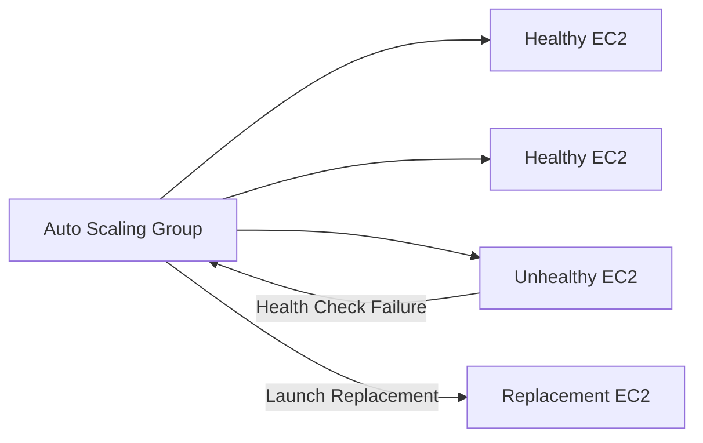
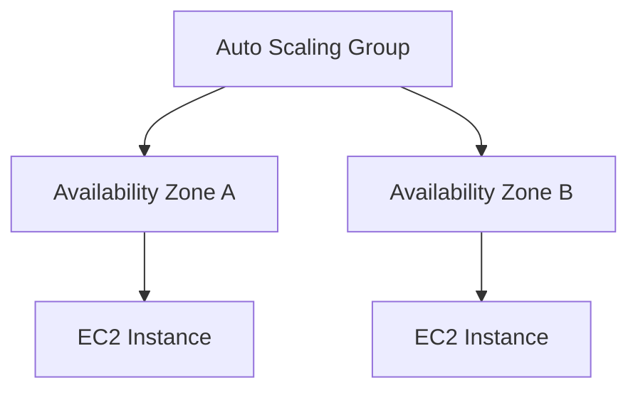

# AWS Auto Scaling Group

## Introduction

An **Auto Scaling Group (ASG)** automatically maintains the required number of EC2 instances for an application.

It can **launch new instances** when capacity is needed and **terminate instances** when they are no longer required.

---

## Core Components

- Launch Template
- Minimum Capacity
- Desired Capacity
- Maximum Capacity
- Availability Zones
- Health Checks
- Scaling Policies

---

## Architecture

```mermaid
flowchart TB
    LT["Launch Template<br/>EC2 Configuration"]

    ASG["Auto Scaling Group"]

    EC2A["EC2 Instance 1"]
    EC2B["EC2 Instance 2"]
    EC2C["EC2 Instance 3"]

    LT --> ASG
    ASG --> EC2A
    ASG --> EC2B
    ASG --> EC2C
````

### Flow

**Launch Template → Auto Scaling Group → EC2 Instances**

The Launch Template defines the instance configuration, while the ASG manages the required number of instances.

---

## Capacity Settings

Example:

```text
Minimum Capacity = 2
Desired Capacity = 2
Maximum Capacity = 4
```

This means:

* ASG will maintain at least **2 instances**
* It normally starts with **2 instances**
* It can scale up to **4 instances**

---

## Self-Healing

If an instance becomes unhealthy, the ASG can terminate it and launch a replacement.



---

## Creating an Auto Scaling Group

1. Open **AWS Console → EC2**
2. Select **Auto Scaling Groups**
3. Click **Create Auto Scaling Group**
4. Enter the ASG name
5. Select the required **Launch Template**
6. Select VPC and Availability Zones
7. Configure Minimum, Desired and Maximum capacity
8. Configure health checks
9. Configure Load Balancer if required
10. Add scaling policies
11. Review and create the ASG

---

## ASG with Multiple Availability Zones



Using multiple Availability Zones improves **availability and fault tolerance**.

---

## Key Difference

| Component          | Responsibility              |
| ------------------ | --------------------------- |
| Launch Template    | Defines how EC2 is launched |
| Auto Scaling Group | Maintains EC2 capacity      |
| Scaling Policy     | Decides when to scale       |
| Health Check       | Detects unhealthy instances |

---

## Key Takeaway

> **Auto Scaling Group = Automatically maintains the required EC2 capacity**

It provides **scalability, self-healing and better availability** with minimal manual intervention.

```
```
