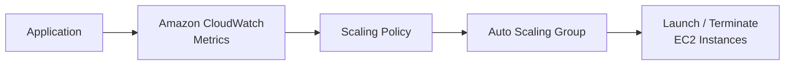

# AWS Auto Scaling Policies

## Introduction

**Auto Scaling Policies** define when an Auto Scaling Group should **increase or decrease EC2 instances** based on application demand.

They help maintain performance while avoiding unnecessary infrastructure cost.

---

## Why Scaling Policies?

```text
High Demand
    ↓
Add EC2 Instances
    ↓
Handle More Traffic

Low Demand
    ↓
Remove EC2 Instances
    ↓
Reduce Cost
````

---

## Types of Scaling Policies

### 1. Target Tracking

Maintains a target value for a CloudWatch metric.

Example:

```text
Target CPU Utilization = 50%
```

If CPU remains above the target, ASG can launch instances.

---

### 2. Step Scaling

Scales based on different metric thresholds.

```text
CPU 50–70%  → Add 1 instance
CPU 70–90%  → Add 2 instances
CPU > 90%   → Add 3 instances
```

---

### 3. Simple Scaling

Uses a CloudWatch alarm to trigger a scaling action.

```text
CPU > 70% → Add 1 instance
CPU < 30% → Remove 1 instance
```

---

## Scaling Architecture



---

## Scale Out vs Scale In

### Scale Out

Adds instances when demand increases.

```text
2 EC2 → 3 EC2 → 4 EC2
```

### Scale In

Removes instances when demand decreases.

```text
4 EC2 → 3 EC2 → 2 EC2
```

---

## Example Configuration

```text
Minimum Capacity = 2
Desired Capacity = 2
Maximum Capacity = 4

Target CPU = 50%

High Demand → Scale Out
Low Demand  → Scale In
```

---

## Important

**CloudWatch → Provides metrics**

**Scaling Policy → Decides when to scale**

**Auto Scaling Group → Performs the scaling action**

> **Scaling Policy = Scaling decision logic**

```
```
