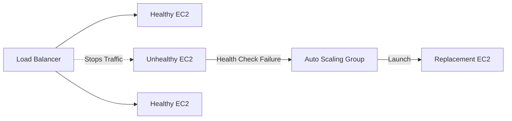

# Load Balancer with Auto Scaling

## Introduction

Combining a **Load Balancer** with an **Auto Scaling Group (ASG)** creates a scalable and highly available application architecture.

The Load Balancer distributes incoming traffic across healthy EC2 instances, while the ASG automatically adjusts the number of instances based on demand.

---

## Architecture

```mermaid
flowchart TB
    USER["Users"] --> LB["Load Balancer"]

    ASG["Auto Scaling Group"]

    LB --> EC2A["EC2 Instance 1"]
    LB --> EC2B["EC2 Instance 2"]
    LB --> EC2C["EC2 Instance 3"]

    ASG --> EC2A
    ASG --> EC2B
    ASG --> EC2C

    CW["Amazon CloudWatch"] --> ASG
````

---

## How It Works

1. Users send requests to the Load Balancer.
2. Load Balancer receives the incoming traffic.
3. It checks the health of registered EC2 instances.
4. Traffic is distributed among healthy instances.
5. CloudWatch monitors application metrics.
6. ASG launches new instances when demand increases.
7. ASG removes instances when demand decreases.
8. New instances can automatically become available to the Load Balancer.

---

## Traffic Distribution

```mermaid
flowchart LR
    USER["Incoming Traffic"] --> LB["Load Balancer"]

    LB --> A["Healthy EC2-1"]
    LB --> B["Healthy EC2-2"]
    LB --> C["Healthy EC2-3"]
```

Instead of sending all requests to a single server, the Load Balancer distributes traffic across multiple healthy instances.

---

## Self-Healing Example

If an EC2 instance becomes unhealthy:

```text
EC2-1 → Healthy
EC2-2 → Unhealthy
EC2-3 → Healthy
```

The Load Balancer stops sending traffic to the unhealthy instance.

The ASG can launch a replacement instance to maintain the desired capacity.



---

## Benefits

* High availability
* Automatic scaling
* Traffic distribution
* Health-based traffic routing
* Self-healing infrastructure
* Reduced manual intervention
* Better resource utilization

---

## Key Components

| Component          | Responsibility                  |
| ------------------ | ------------------------------- |
| Load Balancer      | Distributes incoming traffic    |
| Auto Scaling Group | Maintains required EC2 capacity |
| CloudWatch         | Monitors metrics                |
| Scaling Policy     | Decides when to scale           |
| Launch Template    | Defines EC2 configuration       |

---

## Key Takeaway

> **Load Balancer → Distributes Traffic**
> **Auto Scaling Group → Maintains Capacity**
> **CloudWatch → Monitors Metrics**
> **Launch Template → Defines EC2 Configuration**

```
```
