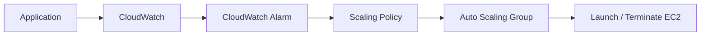
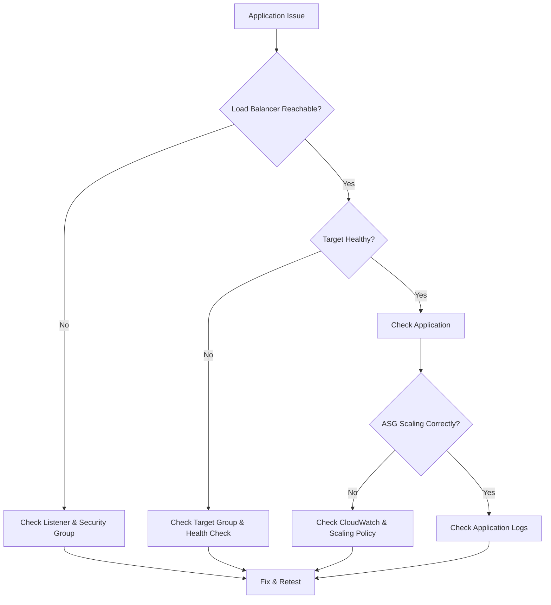

# AWS Load Balancer & Auto Scaling Troubleshooting

## Introduction

When an application using a **Load Balancer + Auto Scaling Group** is not working as expected, troubleshoot the request flow step by step.

```text
User
 ↓
Load Balancer
 ↓
Target Group
 ↓
EC2 Instance
 ↓
Application
````

---

## 1. Target is Unhealthy

Check:

* EC2 instance status
* Application/service status
* Health check path
* Health check port
* Security Group rules

For Apache:

```bash
sudo systemctl status httpd
```

Test the application locally:

```bash
curl http://localhost
```

---

## 2. Load Balancer Cannot Reach EC2

Check:

* Load Balancer listener
* Target Group configuration
* Target health
* Security Group rules
* Application port

Example:

```text
Load Balancer → Port 80
       ↓
Target Group → Port 80
       ↓
EC2 → Port 80
```

---

## 3. ASG Not Launching Instances

Check:

* Launch Template
* AMI
* Instance Type
* Security Group
* IAM Role
* Subnets
* Availability Zones
* Minimum / Desired / Maximum capacity

---

## 4. ASG Not Scaling

Check:

* Scaling Policy
* CloudWatch metrics
* CloudWatch alarms
* Minimum capacity
* Maximum capacity
* Desired capacity

Scaling flow:



---

## 5. EC2 Launches but Application Does Not Work

Check whether User Data executed correctly.

```bash
sudo systemctl status httpd
```

```bash
curl http://localhost
```

Check logs:

```bash
sudo journalctl -u httpd
```

Also verify:

* User Data script
* Application port
* Security Group
* Application configuration

---

## Troubleshooting Architecture



---

## Quick Checklist

```text
✓ EC2 Instance Running
✓ Application Running
✓ Correct Application Port
✓ Security Group Rules
✓ Load Balancer Listener
✓ Target Group Configuration
✓ Target Health
✓ Health Check Path
✓ Launch Template
✓ ASG Capacity
✓ CloudWatch Metrics
✓ Scaling Policy
✓ User Data
```

---

## Troubleshooting Approach

Follow the request path first:

**User → Load Balancer → Target Group → EC2 → Application**

Then check the scaling path:

**CloudWatch → Scaling Policy → Auto Scaling Group → EC2**

> **Check the flow layer by layer instead of changing multiple configurations at once.**

```
```
